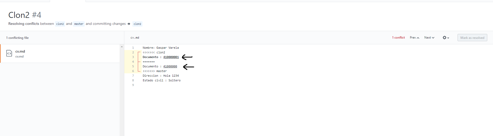

Para ver el repositorio de prueba hacer click [aqui](https://github.com/Koda96/Lab4). 

Al hacer los clones y luego modificar las mismas lineas para hacer el commit y luego mergear sale el siguiente error de pull request  

Se notifica que el hay un conflicto y se debe resolver

Se arregla el error con el editor de GitHub

Se aceptan los cambios y se notifica que ya se puede mergear  

---

La version LOCAL es la que se encuentra en nuestro equipo, en donde se realizan los cambios para luego hacer push al repositorio online (Es lo que esta localmente en el equipo)  

La version REMOTE es la version que esta en un repositorio comun (Por ejemplo GitHub) en donde todos los usuarios participantes pueden hacer cambios.  

La version BASE es el punto donde hacen merge las versiones LOCAL y REMOTE 
